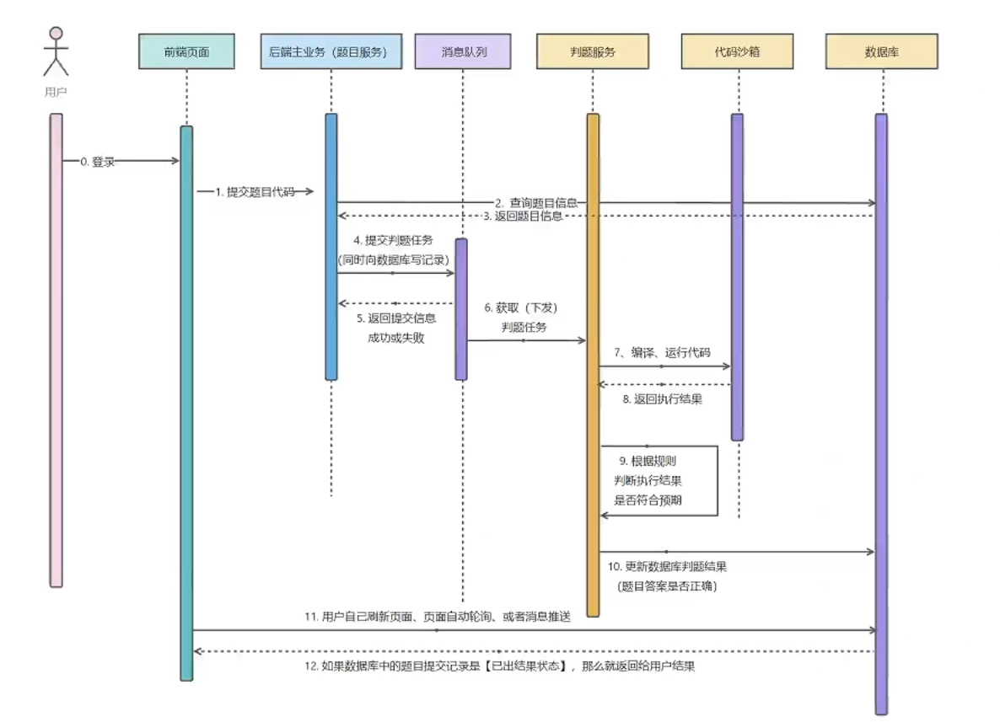

## 判题模块

## 代码沙箱

1. 接受代码和输入
2. 编译执行
3. 得到运行结果并返回
    1. 执行状态
    2. 程序输出
    3. 时间空间

> [!note]
>
> 代码沙箱和判题模块的交互方式：API交互

> [!warning]
>
> 性能优化
>
> 代码沙箱应该接受和输出 多组用例和对应结果，
> 减少接口调用次数、减少网络传输、减少编译次数

### 开发