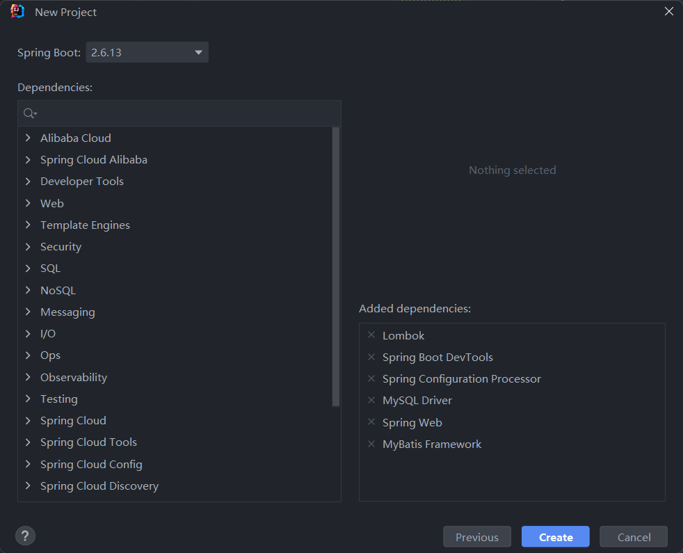

## 技术选型

https://mvnrepository.com/search?q=junit

## 自动生成插件

- MybatisX
    - 自动根据数据库生成domain实体对象
    - mapper（操作数据库对象
    - mapper.xml（mapper对象和数据库的关联，里面可以自己写sql
    - service（包含常用增删改查
    - serviceImpl（具体实现类

## 后端初始化



 

依赖

```xml
mybatis-plus-boot-starter
```

`@Resources`先按照javabean名称注入，再按照类型注入？

## 库表设计

|              |             |      |
| ------------ | ----------- | ---- |
| id           | bigint      |      |
| userName     | varchar     |      |
| userAccount  | varchar     |      |
| avatarUrl    | varvchar    |      |
| gender       | tinyint/int |      |
| userPassword | varchar     |      |
| phone        | varchar     |      |
| email        | varchar     |      |
| userStatus   | int         |      |
| createTime   | datetime    |      |
| updateTime   | datetime    |      |
| isDelete     | tinyint     |      |

- null/not null：灵活点就null
- auto_increment
- primary key

## 注册功能

1. 前端输入账号密码、校验码
2. 校验账号密码
    1. 账号密码位数、是否重复、特殊字符
    2. 密码和校验密码？
3. 密码加密
4. 向数据库插入用户数据


使用Apache Commons Lang辅助校验，例如用一个方法同时判断多个字符串是否有空

```java
/**
 * @author genshinya
 * @description 针对表【user(用户)】的数据库操作Service实现
 * @createDate 2024-05-03 22:27:52
 */
@Service
public class UserServiceImpl extends ServiceImpl<UserMapper, User>
        implements UserService {

    @Override
    public long userRegister(String userAccount, String userPassword, String checkPassword) {
        // 非空
        if (StringUtils.isAnyBlank(userAccount, userPassword, checkPassword)) {
            return -1;
        }
        // 位数
        if (userPassword.length() < 6 || userAccount.length() < 8) {
            return -1;
        }
        // 密码和校验密码
        if (!userPassword.equals(checkPassword)) {
            return -1;
        }
        // 特殊字符


        // 账号不重复
        QueryWrapper<User> queryWrapper = new QueryWrapper<>();
        queryWrapper.eq("userAccount", userAccount);
        long count = this.count(queryWrapper);
        if (count > 0) return -1;

        // 密码加密
        final String SALT = "mySalt";
        String encryptPassword = DigestUtils.md5DigestAsHex((SALT + userPassword).getBytes());

        // 插入数据
        User user = new User();
        user.setUserAccount(userAccount);
        user.setUserPassword(encryptPassword);
        boolean saveResult = this.save(user);
        if (!saveResult) {
            return -1;
        }
        return user.getId();
    }
}
```

这里没有使用mapper注入

```java
    @Resource
    private UserMapper userMapper;
...
  long count = userMapper.selectCount(queryWrapper);
```

### 测试方法

```java
/**
 * 用户服务测试
 *
 * @author genshinya
 */
@SpringBootTest
public class UserServiceTest {
    @Resource
    private UserService userService;
    @Test
    void userRegister() {
        // 正常
        String userAccount = "genshinya";
        String userPassword = "123456";
        String checkPassword = "123456";
        long result = userService.userRegister(userAccount, userPassword, checkPassword);
        Assertions.assertEquals(-1 ,result);
        // 非空校验
        userAccount = "";
        result = userService.userRegister(userAccount, userPassword, checkPassword);
        Assertions.assertEquals(-1 ,result);
        userAccount = "genshinya";
        // 位数校验
        userAccount = "123";
        result = userService.userRegister(userAccount, userPassword, checkPassword);
        Assertions.assertEquals(-1 ,result);
        userAccount = "genshinya";
        // 密码是否相同校验
        checkPassword = "123";
        result = userService.userRegister(userAccount, userPassword, checkPassword);
        Assertions.assertEquals(-1 ,result);
        checkPassword = "123456";
        // 特殊字符校验
        userAccount = "{father}";
        result = userService.userRegister(userAccount, userPassword, checkPassword);
        Assertions.assertEquals(-1 ,result);
        userAccount = "genshinya";

    }
}
```

## 登录逻辑

接受参数：用户账号、密码
请求类型：POST
请求体：JSON格式

> 请求参数很长时不建议用 get 

返回值：脱敏的用户信息

1. 校验用户账户和密码是否合法
2. 校验密码是否正确（比对加密密码
3. 返回**脱敏后的**用户信息，防止数据库字段泄露前端
4. 记录用户登录态(类似session、存到服务器上(SpringBoot框架封装的 tomcat)

### 登录态管理

1. 连接服务端后，得到一个session状态，返回给前端
2. 登录成功后，得到登录成功的session，并且将值保存到session中，返回给前端一个设置cookie的命令
3. 前端接收到后端的命令后，设置cookie，保存到浏览器内
4. 相同域名，前端再次请求后端时，在请求头中带上cookie后请求
5. 后端拿到cookie后找到对应的session
6. 后端再从session中取出基于该session存储的变量(例如用户登录信息、登录名)

